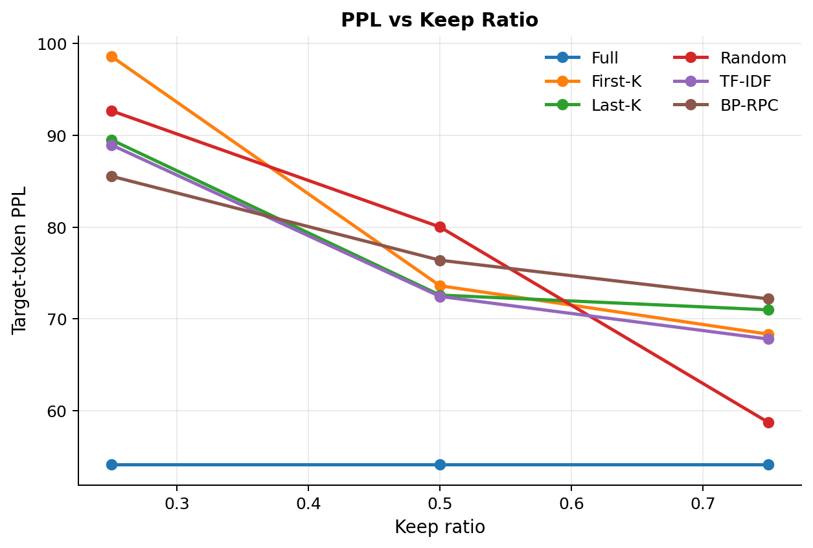
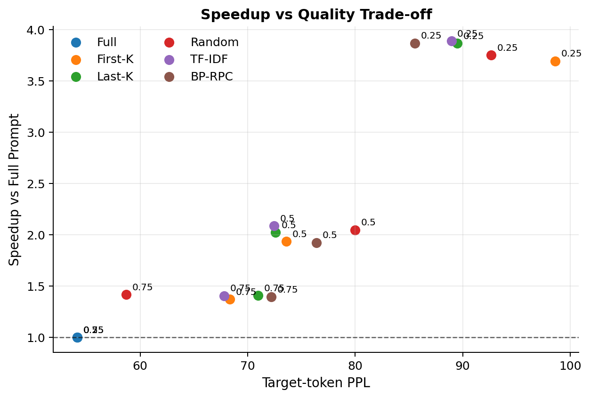

# BP-RPC：边界保留的近期感知 Prompt 压缩

[English README](README.md)

BP-RPC 是一个轻量级、无需训练的 prompt compression 项目，面向语言模型推理加速。它的目标是在推理前减少输入 token 数，从而降低 prefill latency 和总体生成时间，同时尽量保留对续写或回答有用的上下文信息。

本项目默认使用 HuggingFace 上的 `EleutherAI/pythia-70m`。代码面向 MacBook Air 等轻量设备设计，优先支持 CPU，并自动检测 Apple MPS；不依赖 CUDA，不使用 vLLM，也不进行模型训练或微调。

## 结果预览

下面是一次轻量 CPU 实验的示例结果。可以看到，在较低 keep ratio 下，BP-RPC 的 target-token PPL 明显优于 First-K 和 Random，并且接近 Last-K 与 TF-IDF。



笔记本 CPU 的 latency 波动较大，benchmark 数值作为 example run 解读，而不是严格硬件结论。



示例运行的表格摘要见 [docs/results_summary.md](docs/results_summary.md)。

注意：Random baseline 对单个随机种子比较敏感。正式实验建议使用多个 `--random_seeds` 后取平均，避免一次随机抽样“中奖”导致结论不稳。

## 项目特点

- training-free：只做推理和评估，不训练模型。
- 轻量可复现：默认样本数较小，适合普通笔记本运行。
- 多方法对比：包含 Full Prompt、First-K、Last-K、Random、TF-IDF 和 BP-RPC。
- 质量与速度评估：同时支持 target-token PPL 评估和 generation benchmark。
- 数据 fallback：如果 HuggingFace 数据集下载失败，会自动使用内置英文长文本，保证 demo 能跑通。

## 方法说明

本项目比较以下六种方法：

- **Full Prompt**：不压缩，直接使用完整 prompt。
- **First-K**：从 prompt 开头按句子选择内容，直到达到 token budget。
- **Last-K**：从 prompt 结尾按句子选择内容，最后恢复原文顺序。
- **Random**：使用固定随机种子随机选择句子，保证实验可复现。
- **TF-IDF**：把 prompt 末尾若干 token 解码成 pseudo-query，用 TF-IDF 计算每个句子与 pseudo-query 的相关性，并优先保留相关句子。
- **BP-RPC**：结合边界保留、pseudo-query 相关性和近期性分数进行压缩。

BP-RPC 会固定保留 prompt 的前 `keep_head` 个句子和后 `keep_tail` 个句子。对于中间句子，使用如下分数排序：

```text
score_i = alpha * relevance_i + beta * recency_i
```

其中：

- `relevance_i` 是句子与 pseudo-query 的 TF-IDF cosine similarity，并做 min-max normalization。
- `recency_i = i / max(n - 1, 1)`，越靠近 prompt 末尾分数越高。
- `alpha` 和 `beta` 控制相关性与近期性的权重。

如果边界句子本身已经超过预算，BP-RPC 会优先保留 tail 句子，然后在 token 层面截断到指定预算。

## 项目结构

```text
efficient-prompt-compression/
├── README.md
├── README_zh.md
├── requirements.txt
├── src/
│   ├── __init__.py
│   ├── data.py
│   ├── compression.py
│   ├── evaluation.py
│   ├── benchmark.py
│   └── utils.py
├── scripts/
│   ├── run_eval.py
│   ├── run_benchmark.py
│   └── plot_results.py
└── results/
    └── .gitkeep
```

## 安装

建议在虚拟环境中安装依赖：

```bash
pip install -r requirements.txt
```

依赖包括：

- `torch`
- `transformers`
- `datasets`
- `scikit-learn`
- `numpy`
- `pandas`
- `tqdm`

## 运行 PPL 评估

默认命令：

```bash
python scripts/run_eval.py --max_samples 10 --prompt_len 1024 --target_len 128
```

MacBook Air 上建议先跑小规模版本：

```bash
python scripts/run_eval.py --max_samples 5 --prompt_len 512 --target_len 64 --device cpu
```

正式一点的评估建议使用多个 Random seeds：

```bash
python scripts/run_eval.py --max_samples 20 --prompt_len 512 --target_len 64 --device cpu --pair_mode sentence --random_seeds 1 2 3 4 5
```

`--pair_mode sentence` 会让 target 从句子边界开始，更适合本文的句子级 prompt compression 方法。若需要复现最初的固定 token 切分，可以使用 `--pair_mode token`。

如果 HuggingFace 下载模型时出现 SSL、连接中断或超时，可以先尝试镜像：

```bash
export HF_ENDPOINT=https://hf-mirror.com
python scripts/run_eval.py --max_samples 5 --prompt_len 512 --target_len 64 --device cpu
```

也可以先把模型下载到本地目录，再离线运行：

```bash
export HF_ENDPOINT=https://hf-mirror.com
huggingface-cli download EleutherAI/pythia-70m --local-dir models/pythia-70m
python scripts/run_eval.py --model_name models/pythia-70m --max_samples 5 --prompt_len 512 --target_len 64 --device cpu --local_files_only
```

如果你的环境使用新版 HuggingFace CLI，也可以把上面的 `huggingface-cli download` 换成 `hf download`。

评估逻辑：

- 输入为 `compressed_prompt + target`。
- label 中 prompt 部分被设置为 `-100`。
- loss 和 PPL 只在 target tokens 上计算。

输出文件默认保存到：

```text
results/eval_results.csv
```

主要列包括：

- `sample_id`
- `method`
- `keep_ratio`
- `original_prompt_tokens`
- `compressed_prompt_tokens`
- `target_tokens`
- `loss`
- `ppl`

## 运行速度 Benchmark

默认命令：

```bash
python scripts/run_benchmark.py --max_samples 5 --prompt_len 1024 --max_new_tokens 32
```

更轻量的首次测试：

```bash
python scripts/run_benchmark.py --max_samples 3 --prompt_len 512 --max_new_tokens 16 --device cpu
```

生成使用 greedy decoding：

```text
do_sample=False
```

输出文件默认保存到：

```text
results/benchmark_results.csv
```

主要列包括：

- `sample_id`
- `method`
- `keep_ratio`
- `original_prompt_tokens`
- `compressed_prompt_tokens`
- `generated_tokens`
- `total_time`
- `time_per_output_token`
- `throughput_tokens_per_sec`

## 绘制结果图

当 `results/eval_results.csv` 或 `results/benchmark_results.csv` 已经生成后，可以直接画图：

```bash
python scripts/plot_results.py
```

默认输出到：

```text
results/figures/
```

会根据已有 CSV 自动生成以下图：

- `ppl_vs_keep_ratio.png`：不同方法在不同压缩比例下的 PPL。
- `loss_vs_keep_ratio.png`：不同方法在不同压缩比例下的 target-token loss。
- `compressed_tokens_vs_keep_ratio.png`：压缩后的 prompt token 数。
- `latency_vs_keep_ratio.png`：generation 总耗时。
- `throughput_vs_keep_ratio.png`：输出 token 吞吐率。
- `speedup_vs_keep_ratio.png`：相对 Full Prompt 的加速比。
- `speedup_vs_ppl_tradeoff.png`：速度与质量折中图。

如果 PPL 有极端异常值，导致图被拉得不好看，可以设置上限：

```bash
python scripts/plot_results.py --max_ppl 200
```

如果 PPL 的方差很大，建议同时看中位数图和逐样本 winner count：

```bash
python scripts/plot_results.py --agg median
python scripts/summarize_results.py
```

这可以避免少数样本把 mean PPL 拉偏，尤其适合分析 Random baseline。

也可以指定输入和输出路径：

```bash
python scripts/plot_results.py \
  --eval_csv results/eval_results.csv \
  --benchmark_csv results/benchmark_results.csv \
  --output_dir results/figures
```

## 推荐实验表格

课程报告中可以整理以下表格或图：

- **PPL vs keep ratio**：比较不同压缩比例下的质量变化。
- **compressed tokens vs latency**：分析输入 token 数与推理时间的关系。
- **speedup vs quality trade-off**：展示加速收益和 PPL 损失之间的折中。
- **winner counts**：用 `scripts/summarize_results.py` 查看每个样本上谁最好，避免只看 mean PPL。

一个简单的结果分析角度是：

- First-K 是否容易丢失最近上下文。
- Last-K 是否比 First-K 更适合续写任务。
- TF-IDF 是否能保留与结尾 pseudo-query 更相关的句子。
- BP-RPC 是否在保留开头指令、结尾上下文和中间相关信息之间取得更稳定的平衡。

## 常用参数

`scripts/run_eval.py` 支持：

```text
--model_name
--dataset_name
--dataset_config
--split
--max_samples
--prompt_len
--target_len
--pair_mode
--keep_ratios
--methods
--output
--seed
--random_seeds
--device
--cache_dir
--local_files_only
```

`scripts/run_benchmark.py` 支持：

```text
--model_name
--dataset_name
--dataset_config
--split
--max_samples
--prompt_len
--pair_mode
--keep_ratios
--methods
--max_new_tokens
--output
--seed
--random_seeds
--device
--cache_dir
--local_files_only
```

`scripts/plot_results.py` 支持：

```text
--eval_csv
--benchmark_csv
--output_dir
--format
--dpi
--max_ppl
```

## 注意事项

- MacBook Air 上建议先使用 `--max_samples 5` 或更小值。
- 如果 MPS 后端出现兼容性问题，可以加 `--device cpu` 强制使用 CPU。
- 第一次运行可能需要下载模型和数据集，耗时取决于网络环境。
- 如果 HuggingFace 连接失败，可以设置 `HF_ENDPOINT=https://hf-mirror.com`，或用 `--model_name` 指向本地模型目录。
- 如果外部数据集下载失败，代码会 fallback 到内置英文长文本。
- PPL 只在 target tokens 上计算，因此更适合比较不同压缩 prompt 对后续预测质量的影响。
- 本项目是推理加速实验，不包含训练、微调或模型蒸馏。
