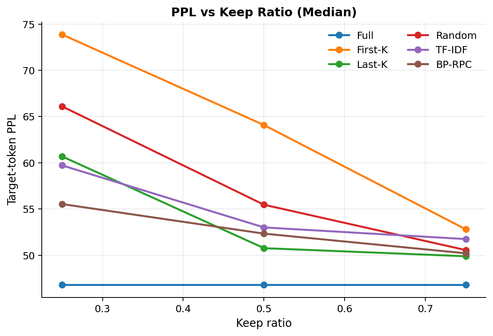

# Example Results Summary

This page summarizes one lightweight CPU run. The exact numbers may vary across machines, Python environments, and background system load.

## Target-token PPL

Evaluation setup:

- Samples: 20
- Prompt length: 512 tokens
- Target length: 64 tokens
- Model: `EleutherAI/pythia-70m`
- Device: CPU

| Method | 0.25 | 0.50 | 0.75 |
|---|---:|---:|---:|
| Full | 54.15 | 54.15 | 54.15 |
| First-K | 98.58 | 73.61 | 68.34 |
| Last-K | 89.50 | 72.59 | 70.99 |
| Random | 92.66 | 80.01 | 58.72 |
| TF-IDF | 88.95 | 72.45 | 67.80 |
| BP-RPC | 85.53 | 76.39 | 72.18 |

BP-RPC is strongest among compressed methods at the 25% keep ratio in this run. At 75%, the single-seed Random baseline happens to perform unusually well, which is why formal runs should average Random over multiple seeds.

Mean PPL is sensitive to outlier samples. The median PPL plot gives a complementary view of typical-case behavior:

Per-sample winner counts after averaging Random seeds:

| Keep ratio | First-K | Last-K | Random | TF-IDF | BP-RPC |
|---|---:|---:|---:|---:|---:|
| 0.25 | 5 | 5 | 2 | 2 | 6 |
| 0.50 | 4 | 7 | 1 | 1 | 7 |
| 0.75 | 5 | 4 | 2 | 1 | 8 |

## Generation Speedup

Benchmark setup:

- Samples: 5
- Prompt length: 512 tokens
- Max new tokens: 16
- Device: CPU

| Method | 0.25 | 0.50 | 0.75 |
|---|---:|---:|---:|
| Full | 1.00x | 1.00x | 1.00x |
| First-K | 3.69x | 1.93x | 1.37x |
| Last-K | 3.87x | 2.02x | 1.41x |
| Random | 3.75x | 2.05x | 1.42x |
| TF-IDF | 3.89x | 2.09x | 1.40x |
| BP-RPC | 3.87x | 1.92x | 1.39x |

These speed numbers are illustrative. Laptop CPU benchmarks can be noisy, so the latency experiment is best interpreted together with compressed token counts and repeated runs.

## Figures

